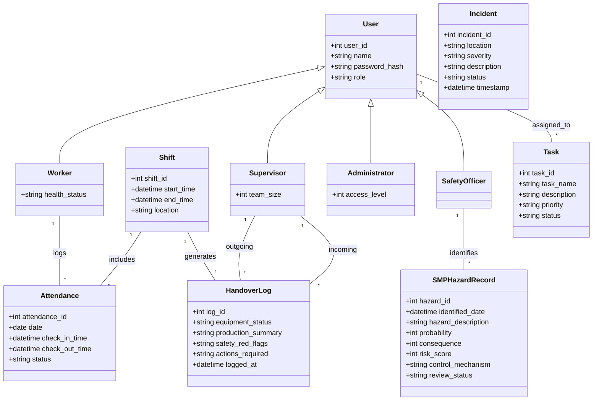
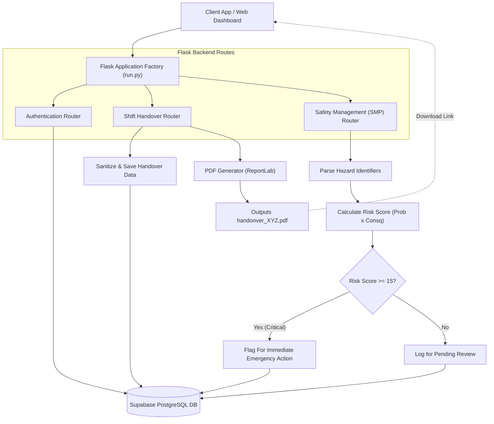

# Full Project Diagrams

Here are the unified diagrams outlining the complete Coal Mine Safety & Productivity Management system, including all the user hierarchy roles, DGMS SMP standards, and Shift Handover functionality.

## 1. Core Data Models (Class Architecture)

This diagram outlines how the entities interact with each other inside your PostgreSQL (Supabase) database. It accounts for user inheritance and links shift instances with their respective attendees and handover logs.

---

## 2. API Workflow & Data Generation (Flowchart)

This diagram represents the logical workflows taking place inside the Flask Backend, illustrating how Data from the App flows through the system to hit Supabase or to automatically generate your PDF Logs.

> [!TIP]
> **Extending this system:** If you hook into an ERP software in the future (like SAP or Oracle), you can connect the "Equipment Status" block inside the *Shift Handover Router* directly to your ERP’s maintenance module so mechanics receive instant breakdown tags!

---

## 3. API Endpoints Reference

This section outlines the primary API pathways exposed by the Flask backend that your Web and App clients will communicate with.

### Authentication (`/auth`)

| Method | Endpoint | Description | Expected Input (JSON) | Expected Output (JSON) |
|---|---|---|---|---|
| `POST` | `/auth/login` | Authenticates an existing user. | `{"username": "...", "password": "..."}` | `{"token": "JWT_TOKEN", "role": "Supervisor"}` |
| `POST` | `/auth/register` | Registers a new staff member. | `{"name": "...", "password": "...", "role": "Worker"}` | `{"message": "Registration successful"}` |
| `GET` | `/auth/me` | Retrieves the logged-in user's profile. | *(Headers: Authorization Bearer Token)* | `{"user_id": 1, "name": "John Doe", "role": "Worker"}` |

### Shifts & Handover Logs (`/shifts`)

| Method | Endpoint | Description | Expected Input (JSON) | Expected Output (JSON) |
|---|---|---|---|---|
| `POST` | `/shifts/` | Creates a new shift block entry. | `{"start_time": "2024-05-01T06:00:00", "end_time": "2024-05-01T14:00:00", "location": "Main Pit"}` | `{"message": "Shift log created", "shift_id": 402}` |
| `POST` | `/shifts/check-in` | Tracks worker attendance at start of shift. | `{"shift_id": 402, "worker_id": 45}` | `{"message": "Checked in successfully"}` |
| `POST` | `/shifts/handover` | **Digital Shift Handover.** Logs details & generates the statutory PDF report. | `{"shift_id": 402, "equipment_status": "Excavator EX-04 Breakdown...", "production_summary": "1200T achieved...", "safety_red_flags": "Highwall instability near Sector 4B", "actions_required": "Geotech survey required"}` | `{"message": "Shift handover logged...", "pdf_report_path": "/path/to/report.pdf"}` |
| `GET` | `/shifts/handover/download` | Retrieves the generated PDF log file. | *(Query Param: `?path=/path/to/report.pdf`)* | *(The raw PDF file download stream)* |

### Safety Management Plan & Incidents (`/incidents`)

| Method | Endpoint | Description | Expected Input (JSON) | Expected Output (JSON) |
|---|---|---|---|---|
| `POST` | `/incidents/smp/hazard` | **Logs a DGMS SMP Hazard.** Mathematically calculates Risk Score (Probability $\times$ Consequence). | `{"location": "Sector 4B", "hazard_description": "Water seepage", "probability": 4, "consequence": 4, "control_mechanism": "Install booster pumps"}` | `{"message": "Hazard recorded", "calculated_risk_score": 16, "requires_immediate_action": true}` |
| `GET` | `/incidents/smp/dashboard`| Retrieves dashboard stats for active hazards (for Safety Officers). | *None* | `{"active_hazards": 2, "pending_reviews": 1, "critical_risks": 1}` |
| `POST` | `/incidents/` | Reports a general, non-SMP incident or general accident. | `{"location": "Haul Road 2", "severity": "Medium", "description": "Truck tire puncture."}` | `{"message": "Incident reported"}` |
| `PUT` | `/incidents/<id>/review` | Updates the status of an existing incident report. | `{"status": "Closed"}` | `{"message": "Incident 5 reviewed"}` |
